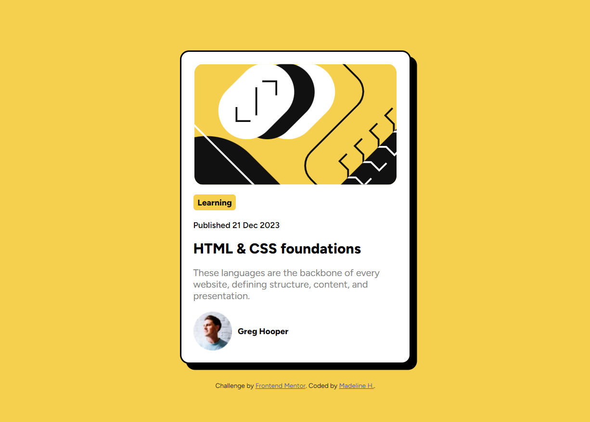

# Frontend Mentor - Blog preview card

This is a solution to the [Blog preview card challenge on Frontend Mentor](https://www.frontendmentor.io/challenges/blog-preview-card-ckPaj01IcS). Frontend Mentor challenges help you improve your coding skills by building realistic projects. 

## Table of contents

- [Overview](#overview)
  - [Preview](#preview)
  - [Links](#links)
- [My process](#my-process)
  - [Built with](#built-with)
  - [What I learned](#what-i-learned)
  - [Continued development](#continued-development)
  - [Useful resources](#useful-resources)
- [Author](#author)
- [Acknowledgments](#acknowledgments)

## Overview

### Preview

### Links

- Live Site URL: [https://madeline0421.github.io/blog-preview-card/](https://madeline0421.github.io/blog-preview-card/)

## My process

### Built with

- Semantic HTML5 markup
- CSS custom properties
- Flexbox

### What I learned

I wanted this project to be more review for HTML/CSS, and I learned a lot of small but important details about CSS: 

- Make sure `
`s for elements are used as a last resort. For example, text content should have `
` tags which denotes hierarchy better.
- alt text for purely decorative images can be left blank, but otherwise, alt text should be as descriptive as possible so they are meaningful.

### Useful resources

- [Importance of HTML tag hierarchy for accessibility](https://writeandcodetime.com/blog/understanding-html-tag-hierarchy-for-improved-accessibility-with-code-examples) - This provided more clarity on the importance of the HTML tag hierarchy and why it is important to avoid misusing divs.
- [https://www.frontendmentor.io/solutions/blog-preview-using-csshtml-yeoCO0FRFG#comment-65a7fc839b5bc8d819b294b6](https://www.frontendmentor.io/solutions/blog-preview-using-csshtml-yeoCO0FRFG#comment-65a7fc839b5bc8d819b294b6) - This was feedback I received from members of Frontend Mentor that helped me understand these details. Thank you!

## Author

- Website - [Madeline Hou](https://github.com/Madeline0421)
## Acknowledgments

Thank you to [@Theosaurus-Rex](https://github.com/Theosaurus-Rex) for feedback!